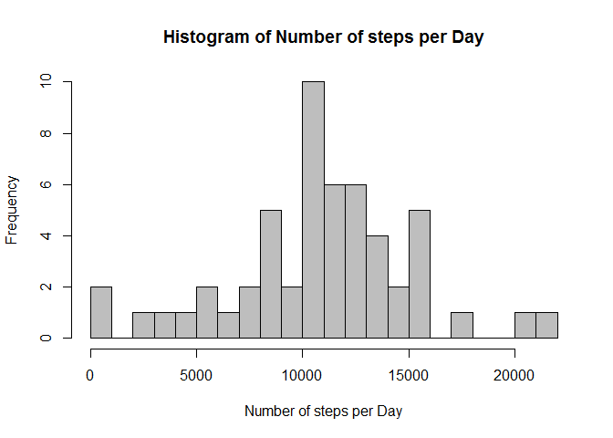
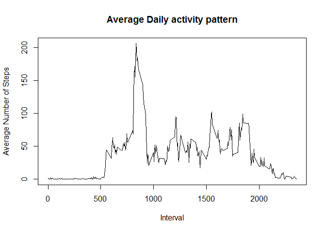
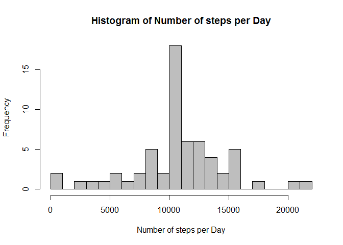
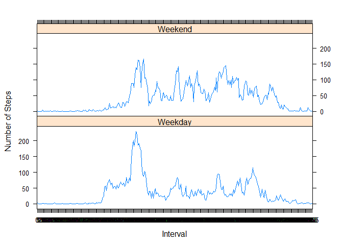

# Reproducible Research: Peer Assessment 1


## Loading and preprocessing the data


```r
stepData <- read.csv("C:/Users/sunil/anuGit11/RepData_PeerAssessment1/activity/activity.csv", header = T, sep = ",")

head(stepData)
```

```
##   steps       date interval
## 1    NA 2012-10-01        0
## 2    NA 2012-10-01        5
## 3    NA 2012-10-01       10
## 4    NA 2012-10-01       15
## 5    NA 2012-10-01       20
## 6    NA 2012-10-01       25
```

```r
summary(stepData)
```

```
##      steps                date          interval     
##  Min.   :  0.00   2012-10-01:  288   Min.   :   0.0  
##  1st Qu.:  0.00   2012-10-02:  288   1st Qu.: 588.8  
##  Median :  0.00   2012-10-03:  288   Median :1177.5  
##  Mean   : 37.38   2012-10-04:  288   Mean   :1177.5  
##  3rd Qu.: 12.00   2012-10-05:  288   3rd Qu.:1766.2  
##  Max.   :806.00   2012-10-06:  288   Max.   :2355.0  
##  NA's   :2304     (Other)   :15840
```

```r
str(stepData)
```

```
## 'data.frame':	17568 obs. of  3 variables:
##  $ steps   : int  NA NA NA NA NA NA NA NA NA NA ...
##  $ date    : Factor w/ 61 levels "2012-10-01","2012-10-02",..: 1 1 1 1 1 1 1 1 1 1 ...
##  $ interval: int  0 5 10 15 20 25 30 35 40 45 ...
```

```r
#Converting the "date" variable to a Date class and the "interval" variable to a factor
stepData$date <- as.Date(stepData$date, format="%Y-%m-%d")
stepData$interval <- factor(stepData$interval)

#remove the NA values from the "Step" observation
removeNA <- is.na(stepData$steps)
stepDataNoNA <- stepData[!removeNA,]

#Aggregating the number of steps taken each day
stepEachDay <- aggregate(steps ~ date, data = stepDataNoNA, sum)

#Histogram of Number of steps per day
hist(stepEachDay$steps,breaks = 20, col="gray", xlab = "Number of steps per Day", main = "Histogram of Number of steps per Day")
```

 


## What is mean total number of steps taken per day?

```r
mean(stepEachDay$steps)
```

```
## [1] 10766.19
```

```r
median(stepEachDay$steps)
```

```
## [1] 10765
```


## What is the average daily activity pattern?

```r
# calculating the average steps per interval
averageSteps <- aggregate(stepDataNoNA$steps, by=list(stepDataNoNA$interval), FUN=mean)
# adding column names
colnames(averageSteps) <- c("Interval", "Average Step")
# plotting the average daily activity pattern
plot(levels(averageSteps$Interval), averageSteps$`Average Step`, type = "l", xlab = "Interval", ylab = "Average Number of Steps", main = "Average Daily activity pattern")
```

 

```r
# Maximum number of average steps & its interval
maxStepInterval <- averageSteps[which.max(averageSteps$`Average Step`),]
maxStepInterval
```

```
##     Interval Average Step
## 104      835     206.1698
```

```r
# only the interval value
maxStepInterval$Interval
```

```
## [1] 835
## 288 Levels: 0 5 10 15 20 25 30 35 40 45 50 55 100 105 110 115 120 ... 2355
```


## Imputing missing values


```r
# total number of missing data in the given dataset
# check the missing data in "steps"
NACount <- table(is.na(stepData$steps))
NACount[2]
```

```
## TRUE 
## 2304
```

```r
# check the missing data in "date"
NACount <- table(is.na(stepData$date))
NACount[2]
```

```
## <NA> 
##   NA
```

```r
# check the missing data in "interval"
NACount <- table(is.na(stepData$interval))
NACount[2]
```

```
## <NA> 
##   NA
```
The missing data is present only in the "steps" column of the dataset "stepData" and the missed data count is 2304.


```r
# Now fill the missing values of the "steps" column by mean for that 5-minute interval respectively

NewStepData <- stepData # take a copy of the original dataset

# find the index of the NA values
NA_index <- which(is.na(NewStepData$steps))
# Imputing missing values using the mean of the 5-minute interval
NewStepData[NA_index,]$steps <- unlist(lapply(NA_index, FUN = function(NA_index){
        averageSteps[stepData[NA_index,]$interval==averageSteps$Interval,]$`Average Step` 
}))

# check the summary of the new data where we filled the missing values
summary(NewStepData)
```

```
##      steps             date               interval    
##  Min.   :  0.00   Min.   :2012-10-01   0      :   61  
##  1st Qu.:  0.00   1st Qu.:2012-10-16   5      :   61  
##  Median :  0.00   Median :2012-10-31   10     :   61  
##  Mean   : 37.38   Mean   :2012-10-31   15     :   61  
##  3rd Qu.: 27.00   3rd Qu.:2012-11-15   20     :   61  
##  Max.   :806.00   Max.   :2012-11-30   25     :   61  
##                                        (Other):17202
```

```r
str(NewStepData)
```

```
## 'data.frame':	17568 obs. of  3 variables:
##  $ steps   : num  1.717 0.3396 0.1321 0.1509 0.0755 ...
##  $ date    : Date, format: "2012-10-01" "2012-10-01" ...
##  $ interval: Factor w/ 288 levels "0","5","10","15",..: 1 2 3 4 5 6 7 8 9 10 ...
```

```r
# Histogram of the total number of steps taken each day 

#Creating a data frame with the steps taken for each day
stepEachDay1 <- aggregate(steps ~ date, data = NewStepData, sum)

hist(stepEachDay1$steps,breaks = 20, col="gray", xlab = "Number of steps per Day", main = "Histogram of Number of steps per Day")
```

 

```r
# mean & median of the total number of steps taken per day
mean(stepEachDay1$steps)
```

```
## [1] 10766.19
```

```r
median(stepEachDay1$steps)
```

```
## [1] 10766.19
```
Observed Result: After inseting the missing values the mean value of the new data set is not changed, and the median of the new data set shifted from 10765 to 10766(difference is negligable). Therefor the mean and median values of the new dataset is same as the original dataset


## Are there differences in activity patterns between weekdays and weekends?

```r
#Creating a factor variable "day "to store the day of the week
NewStepData$day <- factor(weekdays(NewStepData$date))

#Creating a logical variable "is_weekday" (weekday=TRUE, weekend = FALE) :
NewStepData$is_weekday <- ifelse(!(NewStepData$day %in% c("Sunday","Saturday")),TRUE,FALSE)

#Calculating the average number of steps for weekdays
weekday_data <- NewStepData[NewStepData$is_weekday,]
stepEachDay_Weekday <- aggregate(weekday_data$steps, by=list(weekday_data$interval), FUN=mean)
colnames(stepEachDay_Weekday) <- c("Interval", "Average_steps")

#Calculating the average number of steps for weekend
weekday_data <- NewStepData[!NewStepData$is_weekday,]
stepEachDay_Weekend <- aggregate(weekday_data$steps, by=list(weekday_data$interval), FUN=mean)
colnames(stepEachDay_Weekend) <- c("Interval", "Average_steps")

#Adding a column to indecate the day
stepEachDay_Weekday$day <- "Weekday"
stepEachDay_Weekend$day <- "Weekend"

#Merging the two togather
week_data <- rbind(stepEachDay_Weekday, stepEachDay_Weekend)
#Converting the day variabke to a factor
week_data$day <- as.factor(week_data$day)

#Making the plot
library(lattice)
xyplot(Average_steps ~  Interval | day, data = week_data, layout = c(1,2), type ="l", ylab="Number of Steps")
```

 
